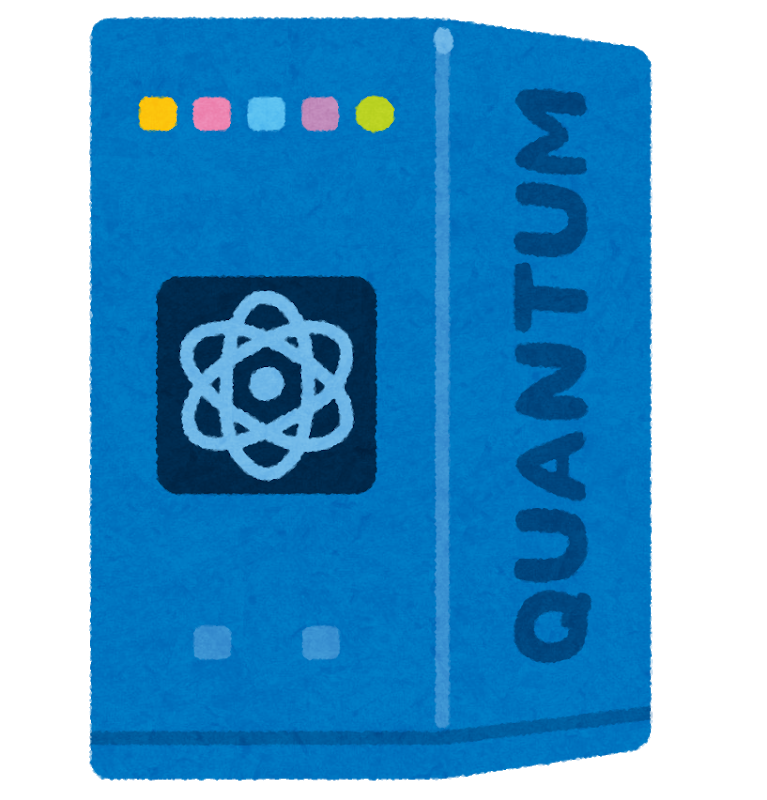

# Qlione [](https://circleci.com/gh/piyo7/qlione)

Qlione is a quantum simulator with pretty circuit DSL in Scala.
It is implemented compactly without library dependencies.

## Features

- notation for complex number & matrix & bra-ket
- pipeline operator to match circuit data flow
- type-level sized bits & gate
- auto normalization in factories
- equality without global phase

## Examples

```scala
import java.util.Random

import com.github.piyo7.qlione.Complex._
import com.github.piyo7.qlione.QuGate._
import com.github.piyo7.qlione._
import com.github.piyo7.qlione._OptNat._

import scala.math.Pi

object Main extends App {
  // Pauli-Y gate
  // (0, -i)
  // (i,  0)
  assert(Y * (|(0).> + (1 + 1.i) * |(1).>) == ((1 - 1.i) * |(0).> + 1.i * |(1).>).bits[_1])

  // quantum Fourier transform
  val result/*: QuBits[_3]*/ =
    (|("000").> + |("100").>).bits[_3] |>
      (H          x I          x I) |>
      (Rz(Pi / 2) . C          x I) |>
      (Rz(Pi / 4) x I)         . C  |>
      (I          x H          x I) |>
      (I          x Rz(Pi / 2) . C) |>
      (I          x I          x H)

  assert(result.reverse == (|("000").> + |("010").> + |("100").> + |("110").>).bits[_3])

  // quantum measurement is probabilistic
  implicit val random = new Random(42)

  println(result)
  println(result.reverse)
  for (_ <- 0 to 10) println(result.reverse.measureAll)
}
```

## Getting Started

Qlione is not published anywhere yet.
However, you can publish it to local against Scala 2.12.x.

```sh
git clone https://github.com/piyo7/qlione.git
cd qlione
sbt publishLocal
```

If you're using SBT, add the following line to your build file:

```scala
libraryDependencies += "com.github.piyo7" %% "qlione" % "0.1.0-SNAPSHOT"
```

## Motivation

http://2018.scalamatsuri.org/en/candidates/TorigoeTakatomo_1/

## Origin of Name

| `"Qunatum".head` | `"Clione".tail` |
| --- | --- |
|  |  |
